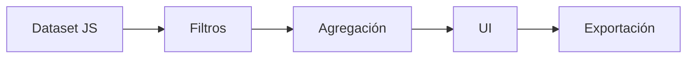

# 📊 PNCM Coverage Report — SAF / SCD

<p align="center">
  <b>🚀 Standalone Web App for Coverage Reporting</b><br>
  Programa Nacional Cuna Más (PNCM) · MIDIS · Perú 🇵🇪
</p>

<p align="center">
  
  
  
  
  
  
</p>

---

## 🧠 ¿Qué es esto?

Aplicación web **100% client-side** diseñada para generar reportes de cobertura del PNCM con enfoque territorial y analítico.

✔ Sin instalación  
✔ Sin backend  
✔ Ejecutable con doble clic  

---

## ⚡ ¿Por qué importa?

- 📊 Reduce tiempos de análisis  
- 🎯 Estandariza reportes institucionales  
- 📈 Mejora la toma de decisiones  
- 🧾 Automatiza narrativa técnica  

---

## 🏛️ Casos de Uso (Gestión Pública — MIDIS)

### 📊 Seguimiento de cobertura territorial
Monitoreo de servicios SAF y SCD a nivel:
- Departamento  
- Provincia  
- Distrito  

---

### 🎯 Toma de decisiones
- Priorización de territorios  
- Identificación de brechas  
- Redistribución de recursos  

---

### 🧾 Reportes institucionales
- Word, Excel y PDF automáticos  
- Informes ejecutivos y técnicos  

---

### 🧠 Planeamiento y análisis
- Evaluación territorial  
- Comparación entre regiones  
- Soporte a UPPM  

---

### ⚙️ Automatización
- Eliminación de procesos manuales  
- Generación en tiempo real  

---

## 🧱 Arquitectura



---

## ✨ Features

- 🔎 Filtros dinámicos  
- ⚡ Cálculo en tiempo real  
- 🧠 Narrativa automática  
- 📊 Tablas inteligentes  
- 📤 Exportación múltiple  

---

## ▶️ Uso

```bash
git clone <repo-url>
abrir PNCM_Cobertura_FEB2026.html
```

---

## 🎥 Demo

<p align="center">
  
</p>

---

## 📅 Datos

- Corte: Febrero 2026  
- Próxima actualización: 16 abril 2026  

---

## 👥 Créditos

UPPM — PNCM — MIDIS 🇵🇪

---

<p align="center">
⭐ Proyecto orientado a impacto en gestión pública
</p>
