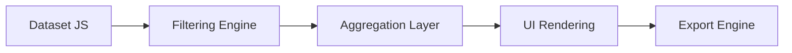
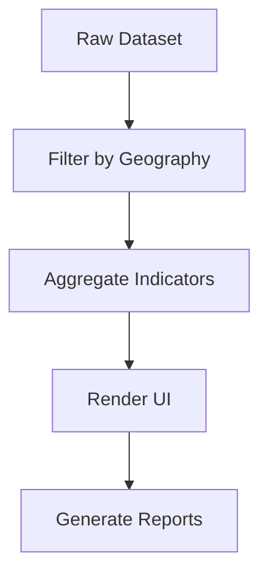

# 📊 PNCM Coverage Report — SAF / SCD

<p align="center">
  <b>🚀 Standalone Web App for Coverage Reporting</b><br>
  Programa Nacional Cuna Más (PNCM) · MIDIS · Perú 🇵🇪
</p>

<p align="center">
  
  
  
  
  
  
</p>

---

## 🧠 What is this?

Aplicación web **100% client-side** diseñada para generar reportes de cobertura del PNCM con enfoque territorial y analítico.

✔ Sin instalación  
✔ Sin backend  
✔ Ejecutable con doble clic  

---

## ⚡ Why it matters

- 📊 Reduce tiempos de análisis
- 🎯 Estandariza reportes institucionales
- 📈 Mejora toma de decisiones territoriales
- 🧾 Automatiza narrativa técnica

---

## 🧱 Architecture (Simple but Powerful)



📌 Todo ocurre en el navegador

---

## ✨ Features

- 🔎 Filtros dinámicos multinivel
- ⚡ Cálculo en tiempo real
- 🧠 Narrativa automática
- 📊 Tablas inteligentes
- 📤 Exportación múltiple (Word, Excel, PDF)
- 🎨 Diseño institucional

---

## 📊 Data Flow



---

## 📤 Export System Deep Dive

| Tipo | Motor | Característica |
|------|------|---------------|
| 📘 Word | HTML MIME | Ligero y compatible |
| 📊 Excel | xlsx-js-style | Formato profesional |
| 📄 PDF | jsPDF | Diseño estructurado |

---

## 🎨 UI Philosophy

- Claridad > Complejidad  
- Datos > Decoración  
- Velocidad > Dependencias  

---

## ▶️ Quick Start

```bash
git clone <repo-url>
open PNCM_Cobertura_FEB2026.html
```

---

## 🧪 Performance

- Dataset: ~17MB  
- Rendering: instantáneo  
- Bottleneck: memoria del navegador  

---

## 🔮 Roadmap

- [ ] Gráficos interactivos  
- [ ] Optimización de dataset  
- [ ] Modo offline real  
- [ ] Modularización  

---

## 🏛️ Context

Proyecto desarrollado para análisis operativo dentro del sector público peruano.

---

## 👥 Credits

UPPM — PNCM — MIDIS 🇵🇪

---

<p align="center">
⭐ Built for impact, not just code
</p>
